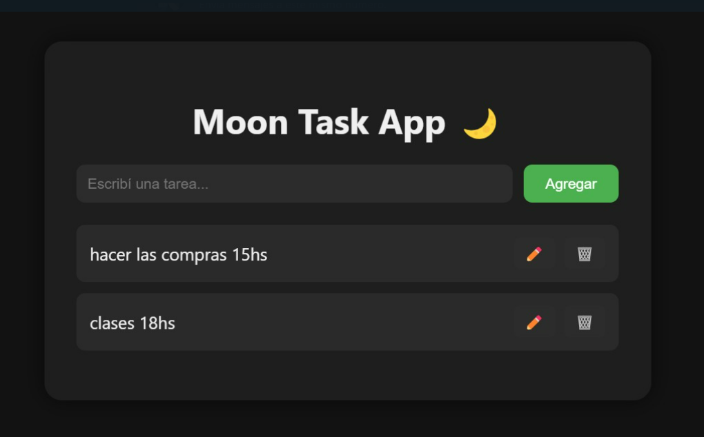
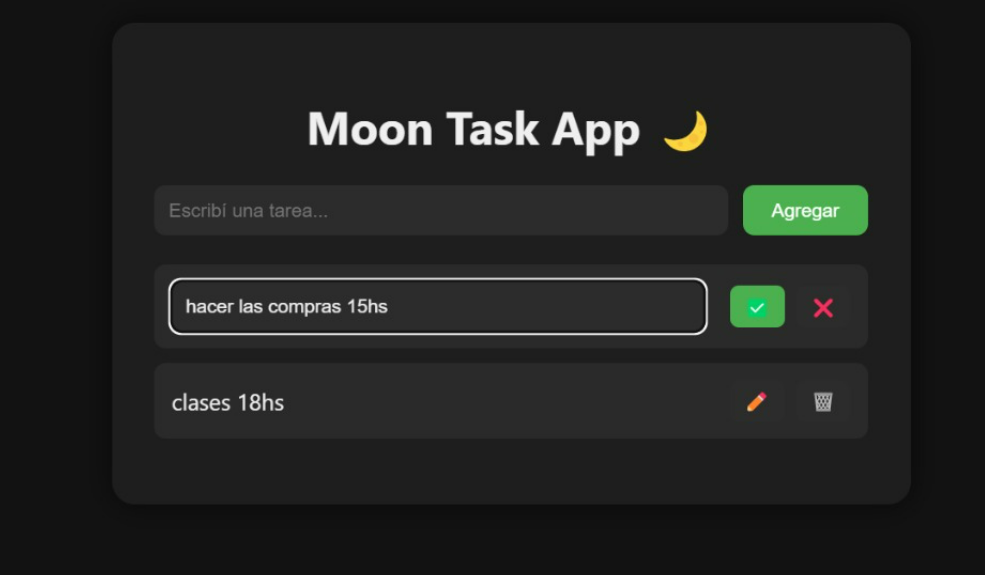

#  Moon Task App 🌙

Una aplicación web full stack simple y moderna para gestionar tareas.  
Desarrollada con Node.js, Express, HTML, CSS , y JavaScript puro.

## 🧩 Funcionalidades

- Agregar nuevas tareas
- Editar tareas existentes directamente desde la interfaz
- Eliminar tareas
- Interfaz en modo oscuro.
- Backend con API REST
- Pruebas unitarias con Jest

## 🚀 Tecnologías utilizadas

- Node.js + Express
- HTML + CSS (modo oscuro)
- JavaScript (fetch API)
- Jest (testing)

## 📦 Instalación y uso

1. Cloná este repositorio:

```bash
git clone https://github.com/jazminLU/ToDo-API
```
2. Instalá las dependencias:

```bash
npm install
```

3. Iniciá el servidor:

```bash
npm start
```
4. Abrí tu navegador en:
```bash
http://localhost:3000
```

5. 🧪 Ejecutar pruebas unitarias

```bash
npm test
```

6. 🖼️ Capturas

### Pantalla principal



### Edición inline




## 🧑‍💻 Autora: Jazmín Lu

### Desarrollado como parte del curso de DevOps – UTN 🚀
